# Lending Club Loan Prediction

## Overview

Lending Club is a peer-to-peer lending company founded in 2007 by John Donovan and Renaud Laplanche. The Lending Club platform allows borrowers to create unsecured personal loans between $1,000 and $40,000. Investors earn money by selecting loans to fund and Lending Club earns money by charging borrowers an origination fee and investors a service fee. From Q2'2007 - Q2'2019, the Lending Club platform originated ~ $38.1 billion in loans and most recently originated ~ $2.2B in Q2'19.

## Motivation

Consumers and investors alike have faced the issue of how to optimize their investment portfolio or how to earn a return on excess cash.  Traditional portfolio management and investment selection is time consuming and complex, leading to the rise of passively managed investment funds for consumers. However, most funds offer standard equity / bond splits with minimal alternative asset selection. Bond investment has also been increasingly tough given the lower rates set by the Federal Reserve and observed in the Treasury Bond yields below. Lending Club's loan platform and open data sets offer us the opportunity to make use of predictive models to attempt to generate higher yield on an alternative asset class.

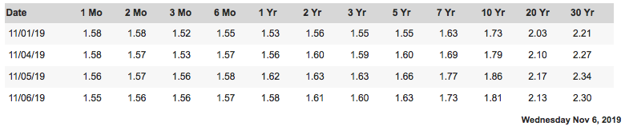

## Data

Lending Club has made their data public [here](https://help.lendingclub.com/hc/en-us/articles/216127307-Data-Dictionaries). The dataset spans ~ 2.5 million loans across 150 features and includes a data dictionary to refer to each term. The data includes features that are observed at the time of loan origination as well as features created based on loan's evolution over time with respect to the status of the loan.

## A First Look

#### Historical Performance

Because we have loans dating back to 2007, we can start by viewing a time series of Lending Club's loans originated per month. The below plot also overlays a plot of the cumulative loan growth as well as Lending Club's stock (NYSE:LC) to see whether loan growth has translated into market capitalization. The below plot also shows (red marker) the date at which Lending Club IPO'ed.

Post-IPO, Lending CLub's strongest month was Mar'16 when it originated $949.4M in loans on its platform. Since IPO, Lending Club has posted strong yearly loan origination numbers as seen below:

|Year|Amount|
|:---|:-----|
|2015|$6.4B|
|2016|$6.4B|
|2017|$6.6B|
|2018|$7.9B|
|2019|$4.1B|

#### Understanding the Loan Mix

The loans on Lending Club are classified in 9 categories: Fully Paid, Current, Charged Off, Late (31-120 days), In Grace Period, Late (16-30 days), Does not meet the credit policy. Status:Fully Paid, Does not meet the credit policy. Status:Charged Off, Default. Below, we have grouped up the loan categories including late, in grace period and in default to show overall, what the Lending Club loan platform has originated.

As we can see here, ~85% of Lending Club loans fall under the Fully Paid or Current category, indicating that a sizable chunk of the loans available to investors are performing. To further break these loans down, we can analyze how Lending Club grades loans.

Lending Club, at loan origination, gives a loan a grade of A to G and a subgrade of 1 to 5 indicating the financial rating of the borrower based on a proprietary model. The model outputs a number ranging from 1 - 25 which is then translated to a grade and a subgrade. For example, a model rank of 6 would correspond to B1. To dive further into how Lending Club loans perform by grade, we have the below plot:

The exact $ (expressed in millions )values are as follows:

| Grade| Principal Paid Off| Outstanding| Bad Debt|
|:-----|:------------------|:-----------|:--------|
| A    | $5,050.3M         | $2,440.4M  | $146.6M |
| B    | $7,196.7M         | $2,884.8M  | $553.5M |
| C    |$6,896.6M          |$2,801.4M   |$1,047.8M|
| D    |$3,399.7M          |$1,415.8M   |$838.5M  |
| E    |$1,518.0| $338.7M | $561.5M|
| F    |$469.9M|$79.4M|$250.6M|
| G    |$135.3M|$25.8M|$87.1M|

Specifically, we can see that Lending Club does a good job rating its loans, with each consecutive grade slightly producing more bad debt than the previous grade.

Additionally, we can observe the relative proportion of fully-paid loans to charged-off loans in the below plot.

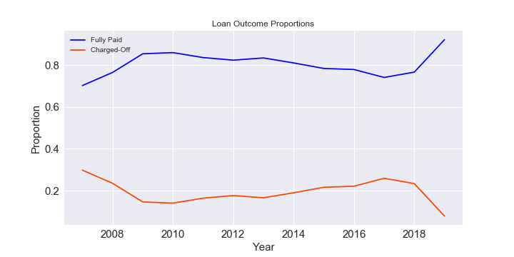
  
We can see that the proportion of good loans on the platform has mostly increased over time, currently settling at ~92%. Applying this information to predictive analytics, we can see that simply picking every loan would lead to a high accuracy metric but we want to also avoid the troubled loans, las charge-offs will impair the return percentages of our predictions.

#### Geographies

To get a sense of how Lending Club's loans are dispersed throughout the U.S., we can view the two below plots:
(Please note that the plots below are .png file representations of an interactive .html file. The html files are saved in the images repository and can be re-created using code found in the src repository)

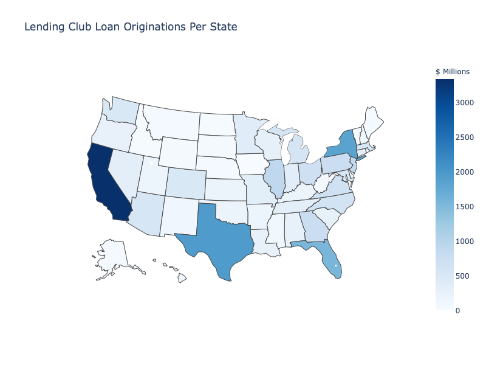
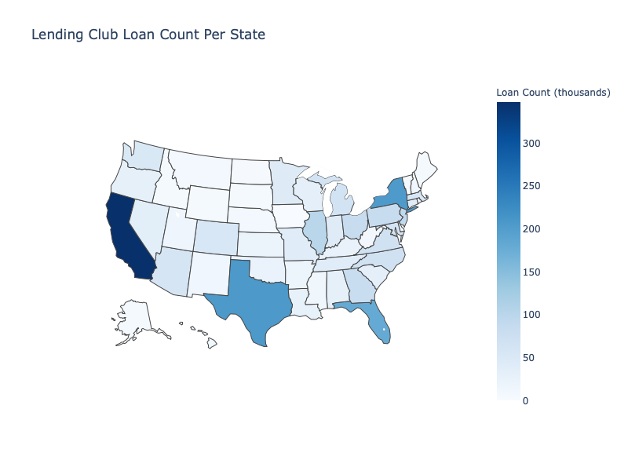

The two plots confirm what may have already been suspected. The largest loan volume is coming from CA, TX, NY, and FL. However, when we look average loan size, we find the following:

|State| Avg Loan Size|
|-----|--------------|
|CA| $15.5K |
|FL| $14.6K|
|NY| $15.0K|
|TX| $15.9K|

This is considerably less than Arkansas which ha an avg loan size of $17.4K.

#### Individuals

Now looking at the profile of individual borrowers, we produce the following plots:

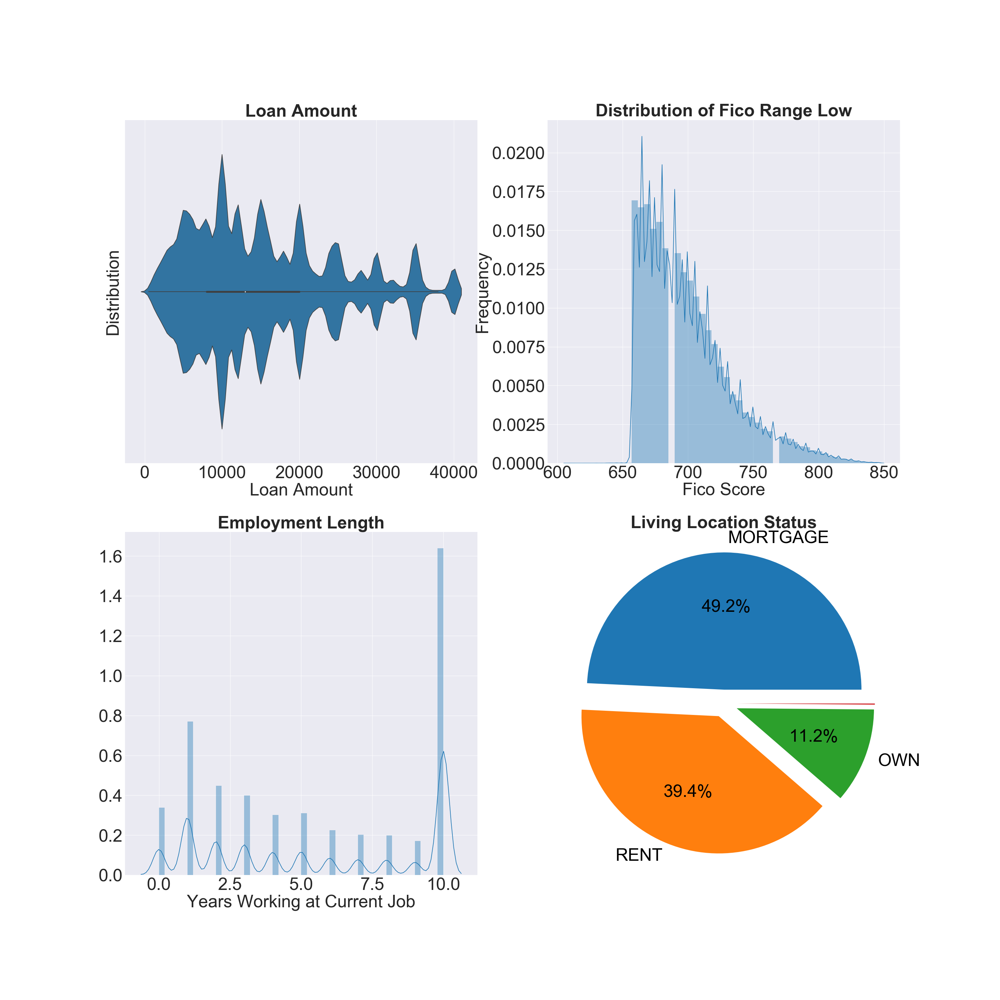

From this, we can conclude the following points:
-  Loan amounts spike around large round numbers and have more density in the < $20,000.00 range
-  The FICO distribution of funded loans has a clear cutoff at ~650 and is right skewed with a large mass less than 700 (considered as the cutoff between a good vs mediocre credit score)
-  A large % of the borrowers have been at their job for a long time, as represented by the large column at the 10 tick. The data lumps in any worker who has worked over 10 years at their current role with those that have been at their current role for exactly 10 years.
-  Almost half of all borrowers have a mortgage with another ~ 40% renting. Only 11.2% own their property, meaning that most borrowers in the data set will have a monthly obligation to rent or a mortgage which will have a large effect on underwriting and credit risk rating.

## Evaluating Returns

grade_returns.png
grade_annualized_returns.png

Because Lending Club assigns grades to their loans, we can evaluate the returns by grade on both an actual return and an annualized return basis. Also, because the loans can only take two different term lengths, 36 or 60 months, we can further divide the grades by term length. We hypothesize that the highest returns should be earned by 60 month rated B-D loans as these will have a greater return compared to their respective 36 month counterparts to compensate for the additional holding time required. Also, we expect these loans to outperform others by grade because A loans will have lower rates of return because they are considered the safest and the loans rated E-G will be expected to have high chargeoff rates, diminishing returns.

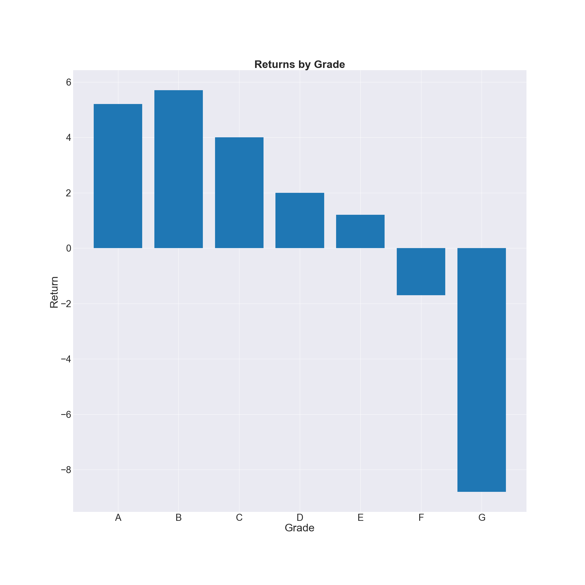

From the two plots, we can see that the highest performing group is the 36 month term B loans with a return of 5.7% and an annualized return of 1.9%. Most surprisingly, we find that the rate of return of Lending Club loans by grade and term length are extremely low compared to the risk in investing in unsecured peer-to-peer loans. We will benchmark our algorithms against these rates of returns:

|Grade| Term | Return | Annualized Return|
|-----|------|--------|------------------|
|A|36|5.2%|1.7%|
|A|60|3.3%|0.7%|
|B|36|5.7%|1.9%|
|B|60|3.5%|0.7%|
|C|36|4.0%|1.3%|
|C|60|2.5%|0.5%|
|D|36|2.0%|0.7%|
|D|60|1.4%|0.3%|
|E|36|0.0%|0.0%|
|E|60|1.2%|0.2%|
|F|36|-1.2%|-0.4%|
|F|60|-1.7%|-0.3%|
|G|36|-8.8%|-3.0%|
|G|60|-5.3%|-1.1%|

## Data Cleaning / Transformation

The data cleaning process included the following:
-  Removing the loans that have not yet paid off / charged-off. We only want to look at the loans that have completed their maturity so that we can see how a loan performed over the course of the term. Including loans that are currently being paid off would throw off any algorithms as loans that may charge-off in the future may still presently be current.

-  Cleaning Features: The majority of this work involved dropping features that would not have been available at the time of loan underwriting as well as converting variables to usable numerical types, whether in the form of scaled numerical features or as a one-hot encoded feature for categorical data. Further, because applications can take on the categories: Individual or Joint, we need to adjust other features that are dependent on this category.

The initial cleaned data set yielded the following features:
-  Issue year: (Numerical) Year loan was issued
-  Grade: (Categorical) Lending Club grade assigned to the loan
-  Subgrade: (Categorical) Lending Club sub-grade assigned to the loan
-  Funded amount: (Numerical) Loan amount funded
-  Term: (Categorical) Term length of loan, can only take on values of either 36 months or 60 months
-  Interest rate: Interest rate applied to the loan
-  Installment: (Numerical) Monthly payment if the loan is funded
-  Purpose: (Categorical) Purpose of the loan, includes credit card consolidation, deb
-  Application type: (Categorical) Type of application, can take on either Individual or Joint Application
-  FICO: (Numerical) FICO score of borrower, created by averaging the low and high range of the borrower's FICO scores
-  DTI: (Numerical) Debt to Income Ratio of the borrower based on the monthly debt payments charged to the borrower versus -  monthly income
-  Annual income: (Numerical) Annual salary of borrower
-  Employment length: (Numerical) Years in current role
-  Home ownership: (Categorical) Indicates whether a borrower owns a home, is paying off a mortgage, rents or has some other living situation
-  Address state: (Categorical) Indicates state the borrower is applying from
-  Earliest credit line: (Numerical) The earliest year the borrower had a credit line
-  Negative activity: (Numerical) Combination of counts of public record bankruptcies and other credit adverse events
-  Inquiries within the last 6 months: (Numerical) Count of times borrower's credit report was inquired upon within the last 6 months
-  Delinquencies within the last 6 months: (Numerical) Count of delinquencies within the last 6 months
-  Verified: (Categorical) Indicates whether the borrower's credit information was Verified, Source Verified, or Not Verified
-  Open accounts: (Numerical) Count of open accounts the borrower has
-  Mortgage Accounts: (Numerical) Count of open mortgage accounts the borrower has
-  Total Current Balance: (Numerical) Total outstanding credit of borrower
-  Revolving: (Numerical) Measures total revolving credit balance
-  Revolving Utilization: (Numerical) Percentage measuring
-  Loan Status: (Categorical) Indicates whether loan was Fully Paid or Charged-Off
-  Total Payment: (Numerical) Sum of payments borrower made on credit

Note that the Loan Status feature is picked as our target variable and the Total Payment feature was kept in the dataset so as to calculate investing returns after training an algorithm.

To transform the data, we apply Sklearn's StandardScaler and OneHotEncoder on the numerical and categorical features respectively. To further improve our training data set, we will apply PCA tp find the principal components. Below is the cumulative sum of the pca explained variance results.

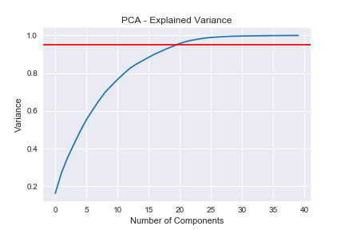
  
We see that ~20 components explain 95% of the variance which shows significant dimensionality reduction from the vast number of features we started with.  
  
Now it is time to start Machine Learning!

## Training Models

####  Setting up the Training / Testing Split

Our data is split roughly 80 / 20 amongst Fully Paid and Charged-Off loans. We want to start by observing how a basic model will predict with the proportion of the training set balanced and altered. Because we have the historical loan amounts and payoffs as well, we can see how changing the balance split of the target variable affects how our model generates returns.

#### Evaluating Target Variable Proportion / Scoring Measures

We choose the following models to perform a grid search for to tune parameters to optimize returns. We will also implement a grid search on the proportion split between the majority and minority class. Some parameters may be optimal at lower proportions and so we do not want to pick an arbitrary proportion and have to tune parameters to that. After performing grid searches on the following models:
-  Logistic Regression
-  Random Forest Classifier
-  Gradient Boosting Classifier

Additionally, because there are two types of loan maturities (36 month term and 60 month term), we can evaluate the returns on either class that our predictive models generate:

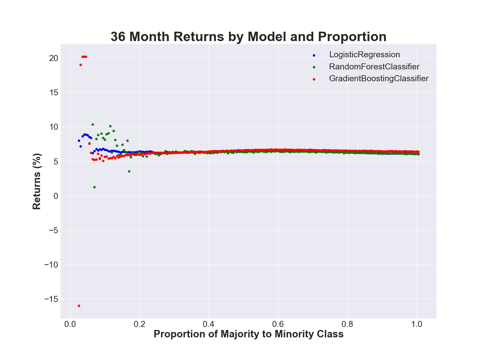
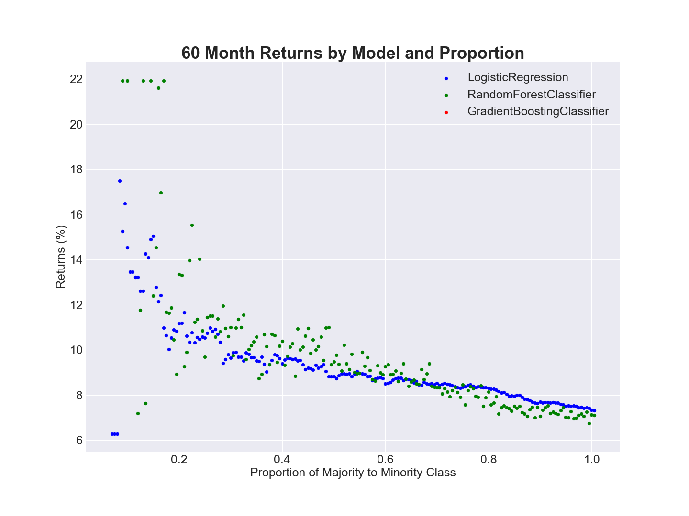
  

Best Models:
|Term|Model|Returns|Deployed Capital|Proportion|
|----|-----|-------|----------------|-----------|
|36|GradientBoostingClassifier|20.22%|24800.00|0.045|
|36|GradientBoostingClassifier|20.22%|24800.00|0.040|
|36|GradientBoostingClassifier|20.22%|24800.00|0.035|
|60|GradientBoostingClassifier|36.15%|23125.00|0.055|
|60|RandomForestClassifier|21.92%|40000.00|0.130|
|60|RandomForestClassifier|21.92%|40000.00|0.170|

We see that the consistently across all models, we experience the highest returns when the proportion of the majority class to the minority class is very low. Specifically, we see this occur in the interval [0.01,0.2]. As we increase the proportion towards a 1:1 split, we see returns converge towards ~6.0% in the case of 36 month term loans and to ~6.8% in the case of 60 month term loans. Also of interest, we see that the GradientBoostingClassifier is clearly the best model at very high and very low proportions. In the range [0.1,0.5], the RandomForestClassifier performs the best. Also, the GradientBoostingClassifier performs extremely well at low levels, posting returns of ~20.0% on its 36 month loans and achieves 36.0% on one proportion for its 5 year loans. Because LendingClub does not offer rates this high, we suspect these outsized returns occurred because a charged-off loan had a high recovery amount, boosting returns.

Next, we see how much capital is being deployed at each proportion. Combining this with our knowledge of the returns earned at each proportion, we find that the outsized returns occur when the deployed capital is the lowest. This presents an interesting divergence in how we can evaluate our models. On the one hand, a retail investor would like to earn maximum returns and likely would not be deploying large capital amounts and so would prefer the best performing models from the lower proportions. An institutional investor would likely prefer stable returns and may see the volatility in returns at the lower proportions less attractive than the stable convergence of returns in the higher returns which would coincide with very high investment amounts.

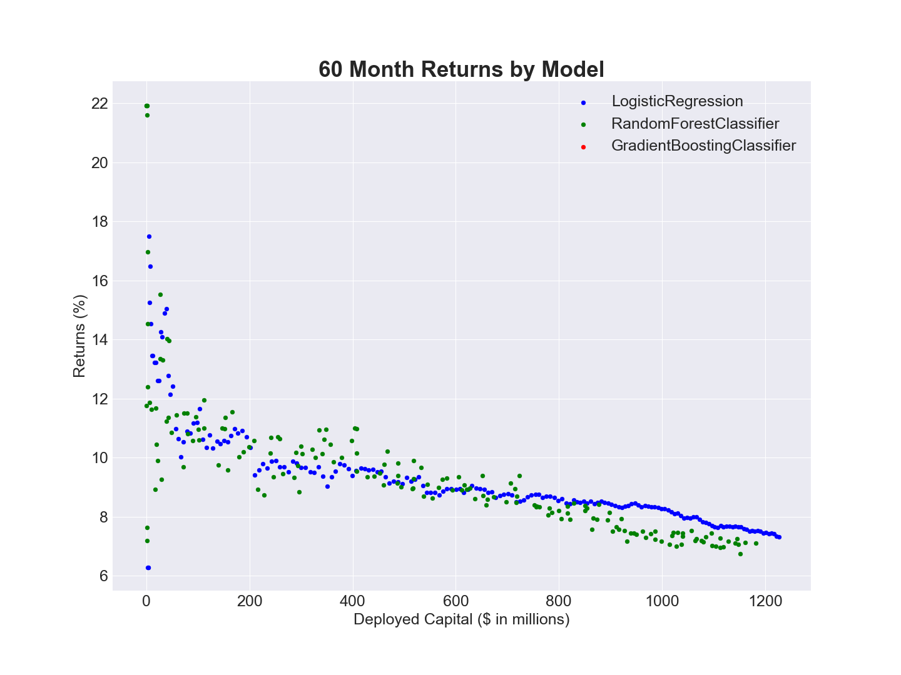
  
Combining the two sets of returns generated by the algorithms, we can view the blended returns and see how this fluctuates with regards to different scoring metrics. In investing, avoiding bad investments is a large aspect of protecting capital to eventually capture returns from performing assets. Below we see how the blended returns change with regards to accuracy and precision.
  
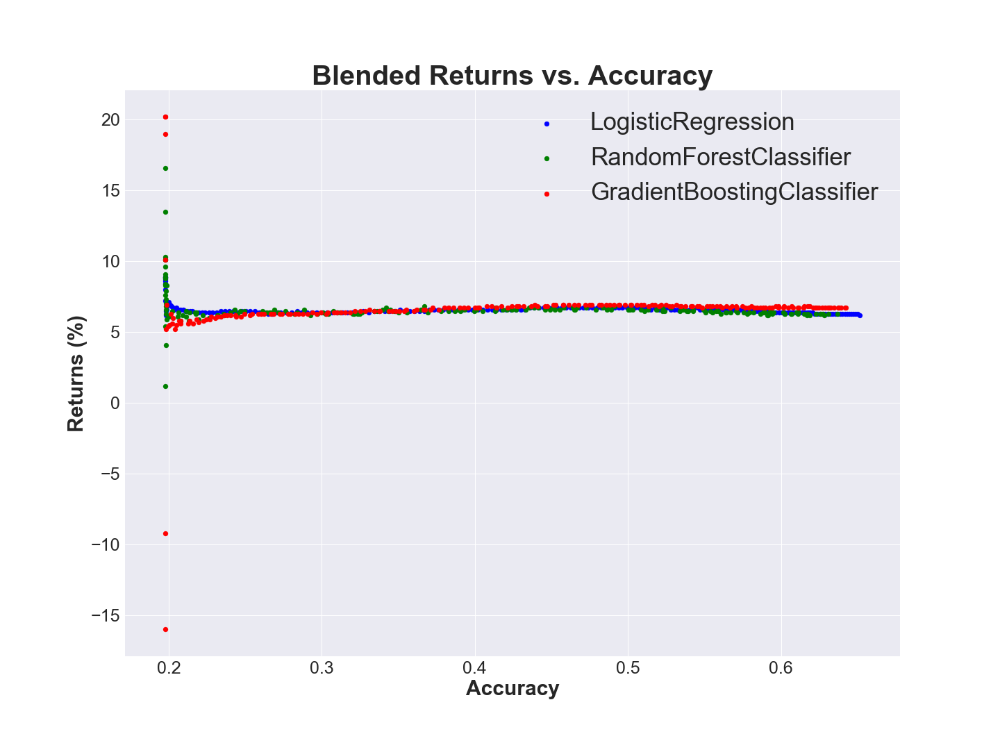

  
We can see that we experience the highest returns when accuracy is low and precision is high. This makes sense because we are lowering accuracy in order to make sure that we only pick good loans. We can then view how to maximize precision based on proportion to get a better idea of which proportion of the majority / minority class to choose.
  
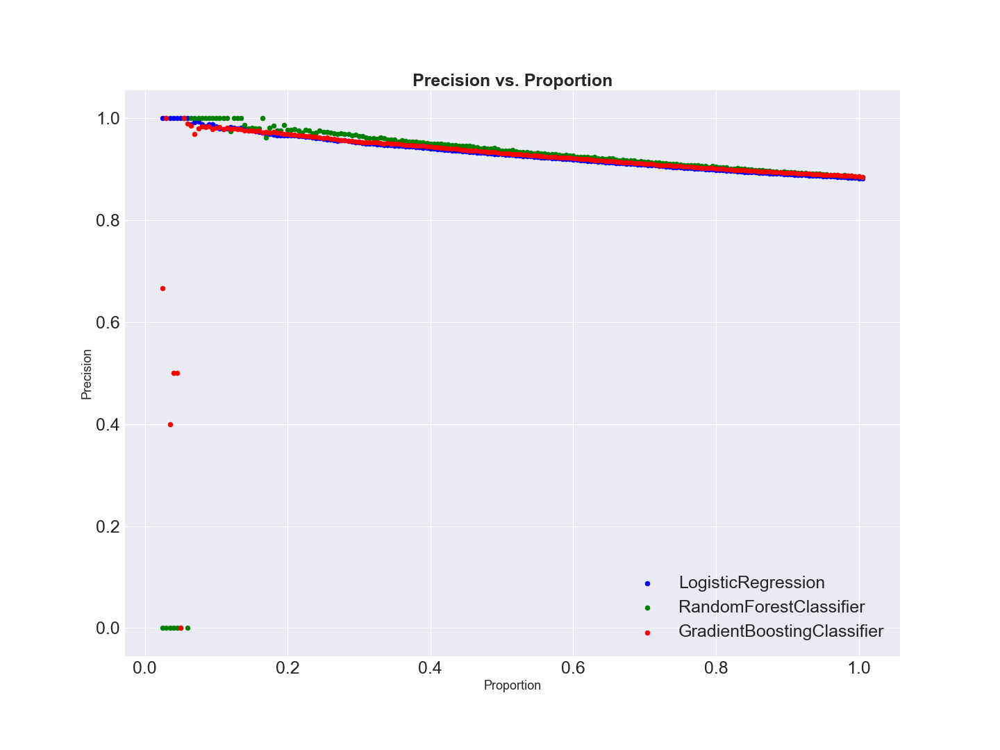
  
We see that at low proportions, all classifiers have a higher precision which drops off linearly as we increase the proportion. The logistic regression model is consistently scoring precision along a linear path whereas the Random Forest and GradientBoosting models have some jumps to 0.0 in the early stages. This is consistent with the returns data observed because the Random Forest and Gradient Boosting models  produce large returns in the beginning based on picking 2-3 loans. In the case in which it picks 1 loan and turns out to be wrong, we witness the dropoff to 0.0 for the precision as well as the jumps in returns.
  

## Sharpe Ratio

To fine tune our models further, we can perform the following:
-  Pick the 3 best models in each model category based on blended returns, 36 month returns and 60 month returns
-  Pick 3 random models with larger proportions
-  For each model (total of 18), run the model 50 times using the gridsearch parameters and train-test split proportion.
-  Calculate the Sharpe Ratio for each category.  

This strategy will allow us to observe the robustness of each model's returns. If there is an element of randomness that caused a model to perform extremely well, performing the train-test split 50 times will help reduce that element. By calculating the Sharpe Ratio, we are applying scores that reward models that produce consistently high returns with minimal variance.

After performing this, we observe the following:

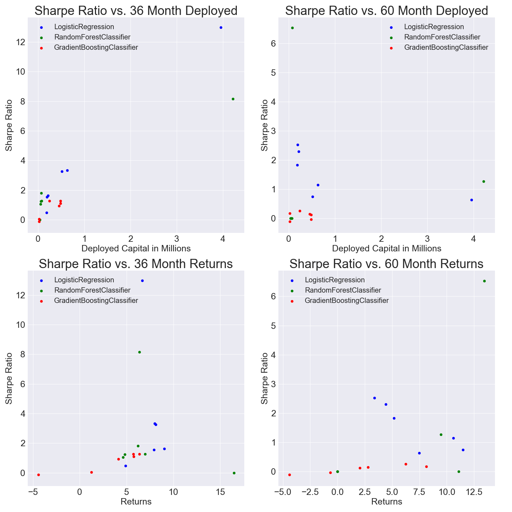

Based on this chart, we can pick the two models to create a final prediction system by taking the top Sharpe scores for both the 36 month and 60 month loan groups.

|Term | Model | Sharpe Ratio | Proportions | Parameters |
|-----------------------------------------------------|
|36 Months| Logistic Regression | 13.0 (36 Month)| 0.085| Params: {'max_depth': 8, 'max_features': 'sqrt', 'min_samples_leaf': 2, 'min_samples_split': 5, 'n_estimators': 50}|
|60 Months| RandomForestClassifier | 6.5 (60 Month) | 0.09| Params: {'C': 0.05, 'penalty': 'l1'}|

Based on this, we can use the Logistic Regression model when we encounter a 36 month term loan and the RandomForestClassifier for 60 month term loans.
Additionally we will run this 1000 times to test the robustness of the system and end up producing the following:

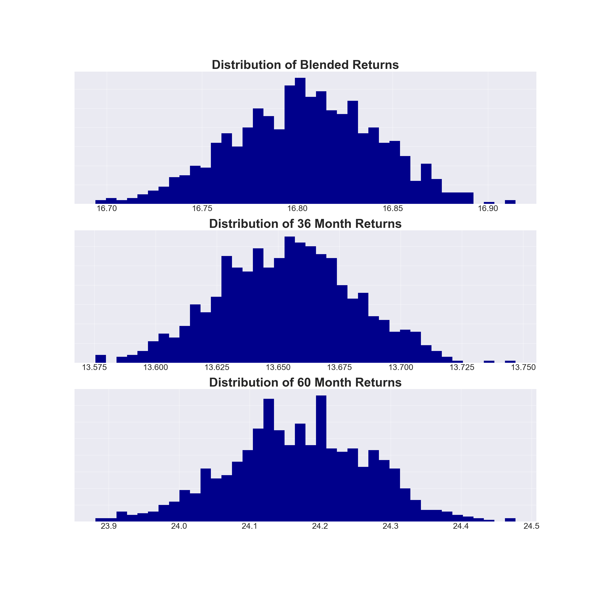
 
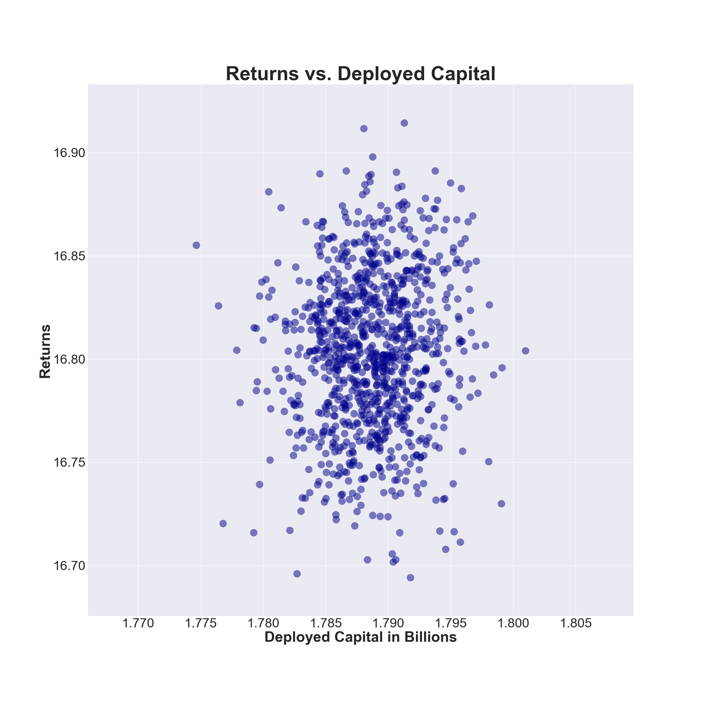

We see here that the system does a strong job and produces:

-  Blended Returns
  -  Mean: 16.80%
  -  Min: 16.69%
  -  Max: 16.91%
-  36 Month Loan Returns:
  -  Mean: 13.65%
  -  Min: 13.57%
  -  Max: 13.74:
-  60 Month Loan Returns:
  -  Mean: 24.17%
  -  Min: 23.88%
  -  Max: 24.48%

Deployed Capital:
-  Deployed Mean: $1.78 Billion
-  36 Month Deployed Mean: $1.25 Billion
-  60 Month Deployed Mean: $0.53 Billion

## Conclusion:

To bring this information full-circle, we were exploring ways to boost returns as opposed to bonds. Lending Club loans offer similar maturity lengths to risk free treasury bonds and better returns but have a higher risk potentiality. By applying machine learning techniques and domain expertise, we were able to produce methods to predict and then analyze the investment applications. Using returns and the Sharpe Ratio we were then able to create a hybrid model which performed far better than any of our previous models. Additionally, the system deployed significant amounts of capital meaning that the algorithm can be used by both retail and institutional investors.

The significance of this is that investors can swap out portions of their bond portfolio with Lending Club loans and expect higher returns by simply deploying this model.  
