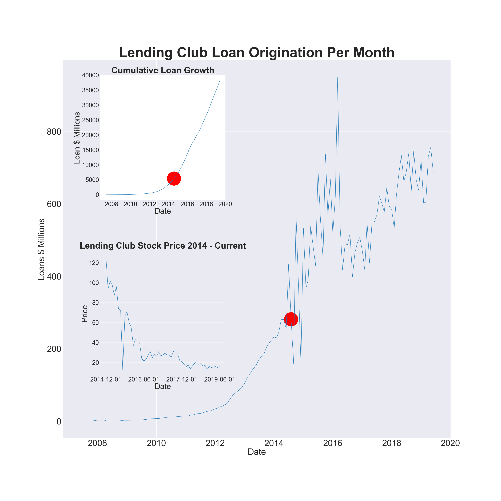

# Lending Club Loan Analysis

## Overview

Lending Club is a peer-to-peer lending company founded in 2007 by John Donovan and Renaud Laplanche. The Lending Club platform allows borrowers to create unsecured personal loans between $1,000 and $40,000. Investors earn money by selecting loans to fund and Lending Club earns money by charging borrowers an origination fee and investors a service fee. From Q2'2007 - Q2'2019, the Lending Club platform originated ~ $38.1 billion in loans, most recently originating ~ $2.2B in Q2'19. 

## Data 

Lending Club has made their data public [here](https://help.lendingclub.com/hc/en-us/articles/216127307-Data-Dictionaries). The dataset spans ~ 2.5 million loans across 150 features and includes a data dictionary to refer to each term. 

## A First Look

Because we have loans dating back to 2007, we can start by viewing a time series of Lending Club's loans originated per month. The below plot also overlays a plot of the cumulative loan growth as well as Lending Club's stock (NYSE:LC) to see whether loan growth has translated into market capitalization. The below plot also shows (red marker) the date at which Lending Club IPO'ed. 

The loans on Lending Club are classified in 9 categories: Fully Paid, Current, Charged Off, Late (31-120 days), In Grace Period, Late (16-30 days), Does not meet the credit policy. Status:Fully Paid, Does not meet the credit policy. Status:Charged Off, Default. Below, we have grouped up the loan categories including late, in grace period and in default to show overall, what the Lending Club loan platform has originated.

Post-IPO, Lending CLub's strongest month was Mar'16 when it originated $949.4M in loans on its platform. Since IPO, Lending Club has posted strong yearly loan origination numbers as seen below:

  
|Year|Amount|
|:---|:-----|
|2015|$6.4B|
|2016|$6.4B|
|2017|$6.6B|
|2018|$7.9B|
|2019|$4.1B|

As we can see here, ~85% of Lending Club loans fall under the Fully Paid or Current category, indicating that a sizable chunk of the loans available to investors are performing. To further break these loans down, we can analyze how Lending Club grades loans. 

Lending Club, at loan origination, gives a loan a grade of A to G and a subgrade of 1 to 5 indicating the financial rating of the borrower based on a proprietary model. The model outputs a number ranging from 1 - 25 which is then translated to a grade and a subgrade. For example, a model rank of 6 would correspond to B1. To dive further into how Lending Club loans perform by grade, we have the below plot:

The exact $ (expressed in millions )values are as follows:

  
| Grade| Principal Paid Off| Outstanding| Bad Debt|
|:-----|:------------------|:-----------|:--------|
| A    | $5,050.3M         | $2,440.4M  | $146.6M |
| B    | $7,196.7M         | $2,884.8M  | $553.5M |
| C    |$6,896.6M          |$2,801.4M   |$1,047.8M|
| D    |$3,399.7M          |$1,415.8M   |$838.5M  |
| E    |$1,518.0| $338.7M | $561.5M|
| F    |$469.9M|$79.4M|$250.6M|
| G    |$135.3M|$25.8M|$87.1M|

