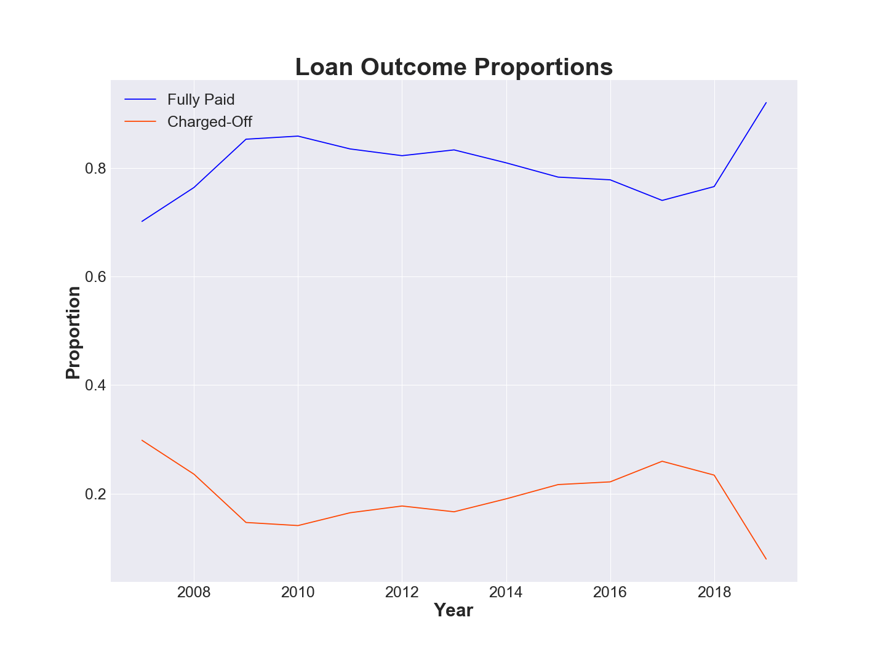
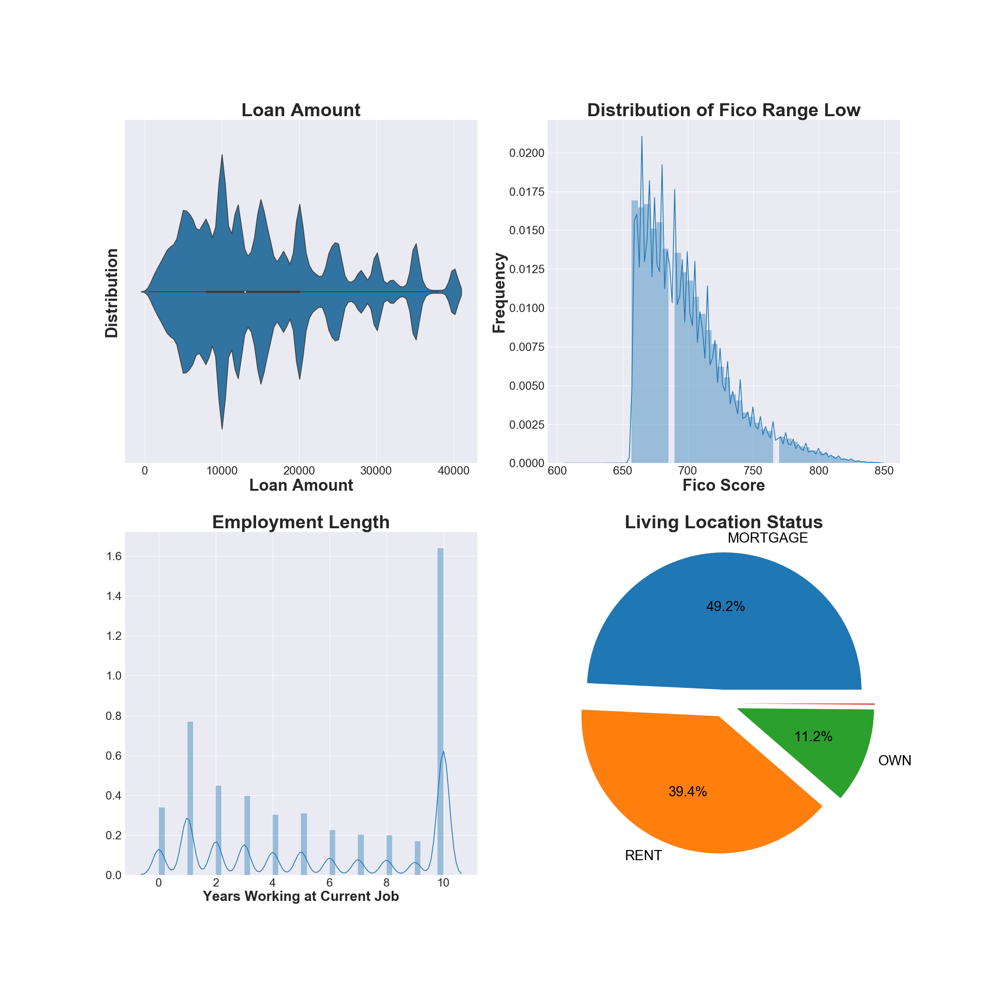
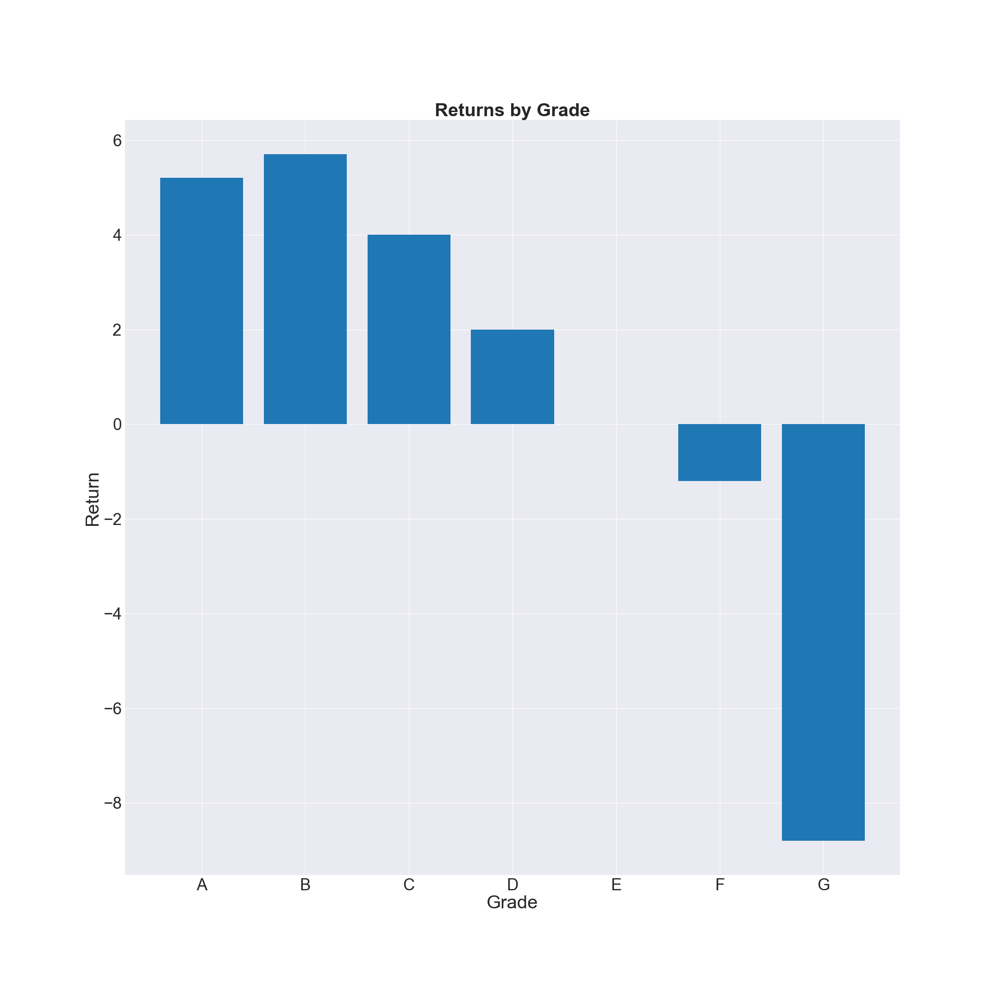
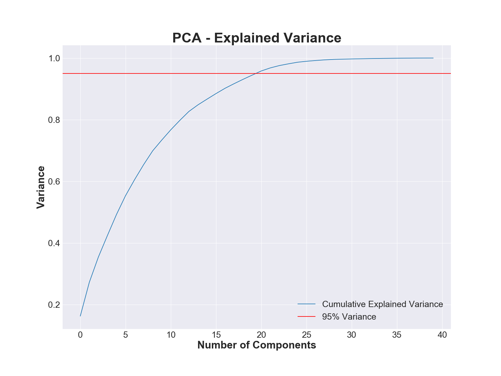
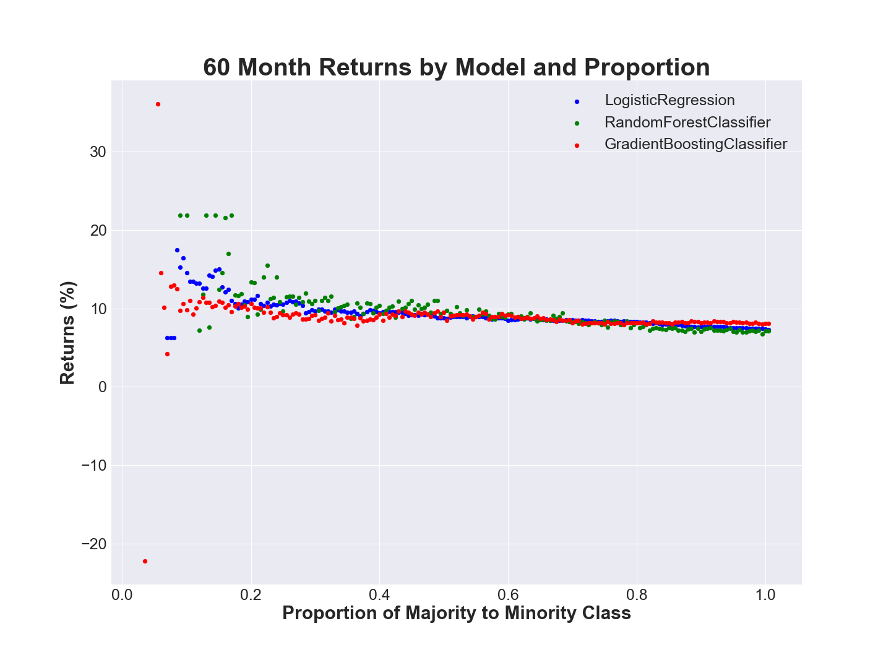
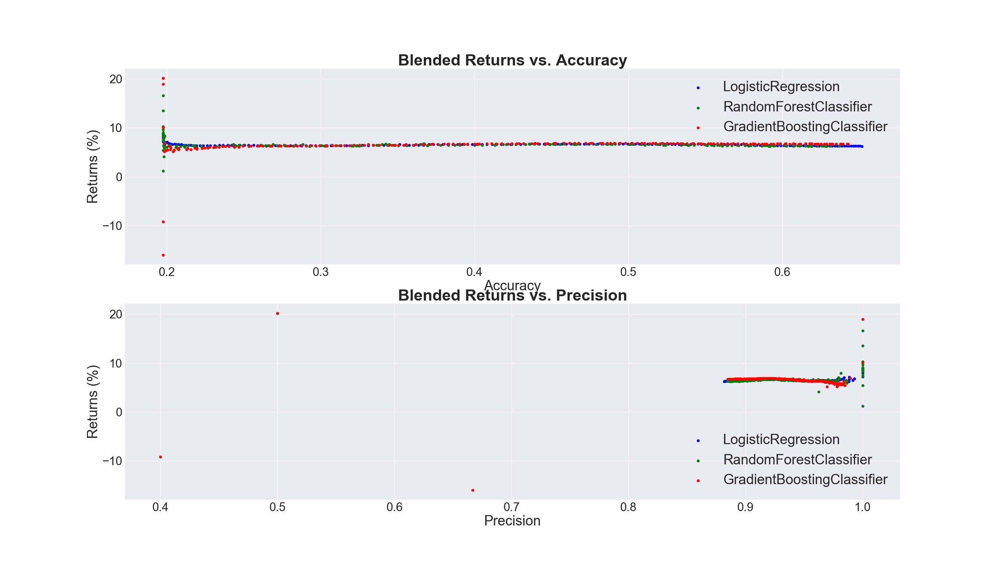

# Lending Club Loan Analysis

## Overview

Lending Club is a peer-to-peer lending company founded in 2007 by John Donovan and Renaud Laplanche. The Lending Club platform allows borrowers to create unsecured personal loans between $1,000 and $40,000. Investors earn money by selecting loans to fund and Lending Club earns money by charging borrowers an origination fee and investors a service fee. From Q2'2007 - Q2'2019, the Lending Club platform originated ~ $38.1 billion in loans, most recently originating ~ $2.2B in Q2'19.

## Motivation

Consumers and investors alike have faced the issue of how to optimize their investment portfolio or how to earn a return on excess cash.  Traditional portfolio management and investment selection is time consuming and complex, leading to the rise of passively managed investment funds for consumers. However, most funds offer standard equity / bond splits with minimal alternative asset selection. Bond investment has also been increasingly tough given the lower rates set by the Federal Reserve and observed in the Treasury Bond yields below:

  
Lending Club's loan platform and open data sets offer us the opportunity to make use of predictive models to attempt to generate higher yield on an alternative asset class.

## Data

Lending Club has made their data public [here](https://help.lendingclub.com/hc/en-us/articles/216127307-Data-Dictionaries). The dataset spans ~ 2.5 million loans across 150 features and includes a data dictionary to refer to each term.

## A First Look

#### Historical Performance

Because we have loans dating back to 2007, we can start by viewing a time series of Lending Club's loans originated per month. The below plot also overlays a plot of the cumulative loan growth as well as Lending Club's stock (NYSE:LC) to see whether loan growth has translated into market capitalization. The below plot also shows (red marker) the date at which Lending Club IPO'ed.

Post-IPO, Lending CLub's strongest month was Mar'16 when it originated $949.4M in loans on its platform. Since IPO, Lending Club has posted strong yearly loan origination numbers as seen below:

|Year|Amount|
|:---|:-----|
|2015|$6.4B|
|2016|$6.4B|
|2017|$6.6B|
|2018|$7.9B|
|2019|$4.1B|

#### Understanding the Loan Mix

The loans on Lending Club are classified in 5 categories: Fully Paid, Current, Charged Off, Late (31-120 days), In Grace Period, Late (16-30 days), Does not meet the credit policy. Status:Fully Paid, Does not meet the credit policy. Status:Charged Off, Default. Below, we have grouped up the loan categories including late, in grace period and in default to show overall, what the Lending Club loan platform has originated.

As we can see here, ~85% of Lending Club loans fall under the Fully Paid or Current category, indicating that a sizable chunk of the loans available to investors are performing. To further break these loans down, we can analyze how Lending Club grades loans.

Lending Club, at loan origination, gives a loan a grade of A to G and a subgrade of 1 to 5 indicating the financial rating of the borrower based on a proprietary model. The model outputs a number ranging from 1 - 25 which is then translated to a grade and a subgrade. For example, a model rank of 6 would correspond to B1. To dive further into how Lending Club loans perform by grade, we have the below plot:

The exact $ (expressed in millions )values are as follows:

| Grade| Principal Paid Off| Outstanding| Bad Debt|
|:-----|:------------------|:-----------|:--------|
| A    | $5,050.3M         | $2,440.4M  | $146.6M |
| B    | $7,196.7M         | $2,884.8M  | $553.5M |
| C    |$6,896.6M          |$2,801.4M   |$1,047.8M|
| D    |$3,399.7M          |$1,415.8M   |$838.5M  |
| E    |$1,518.0| $338.7M | $561.5M|
| F    |$469.9M|$79.4M|$250.6M|
| G    |$135.3M|$25.8M|$87.1M|

Specifically, we can see that Lending Club does a good job rating its loans, with each consecutive grade slightly producing more bad debt than the previous grade.

Additionally, we can observe the relative proportion of fully-paid loans to charged-off loans in the below plot.

  
We can see that the proportion of good loans on the platform has mostly increased over time, currently settling at ~92%. Applying this information to predictive analytics, we can see that simply picking every loan would lead to a high accuracy metric but we want to also avoid the troubled loans, leading to the idea that precision is a better metric to score our models.

#### Geographies

To get a sense of how Lending Club's loans are dispersed throughout the U.S., we can view the two below plots:
(Please note that the plots below are .png file representations of an interactive .html file. The html files are saved in the images repository and can be re-created using code found in the src repository)

The two plots confirm what may have already been suspected. The largest loan volume is coming from CA, TX, NY, and FL. However, when we look average loan size, we find the following:

|State| Avg Loan Size|
|-----|--------------|
|CA| $15.5K |
|FL| $14.6K|
|NY| $15.0K|
|TX| $15.9K|

Which are considerably less than AK, with an avg loan size of $17.4K.

#### Individuals

Now looking at the profile of individual borrowers, we produce the following plots:

From this, we can conclude the following points:
-  Loan amounts spike around large round numbers and have more density in the < $20,000.00 range
-  The FICO distribution of funded loans has a clear cutoff at ~650 and is right skewed with a large mass less than 700 (considered as the cutoff between a good vs mediocre credit score)
-  A large % of the borrowers have been at their job for a long time, as represented by the large column at the 10 tick. The data lumps in any worker who has worked over 10 years at their current role with those that have been at their current role for exactly 10 years.
-  Almost half of all borrowers have a mortgage with another ~ 40% renting. Only 11.2% own their property, meaning that most borrowers in the data set will have a monthly obligation to rent or a mortgage which will have a large effect on underwriting and credit risk rating.

## Evaluating Returns

grade_returns.png
grade_annualized_returns.png

Because Lending Club asigns grades to their loans, we can evaluate the returns by grade on both an actual return and an annualized return basis. Also, because the loans can only take two different term lengths, 36 or 60 months, we can further divide the grades by term length. We hypothesize that the highest returns should be earned by 60 month rated B-D loans as these will have a greater return compared to their respective 36 month counterparts to compensate for the additional holding time required. Also, we expect these loans to outperform others by grade because A loans will have lower rates of return because they are considered the safest and the loans rated E-G will be expected to have high chargeoff rates, diminishing returns.

From the two plots, we can see that the highest performing group is the 36 month term B loans with a return of 5.7% and an annualized return of 1.9%. Most surprisingly, we find that the rate of return of Lending Club loans by grade and term length are extremely low compared to the risk in investing in unsecured peer-to-peer loans. We will benchmark our algorithms against these rates of returns:

|Grade| Term | Return | Annualized Return|
|-----|------|--------|------------------|
|A|36|5.2%|1.7%|
|A|60|3.3%|0.7%|
|B|36|5.7%|1.9%|
|B|60|3.5%|0.7%|
|C|36|4.0%|1.3%|
|C|60|2.5%|0.5%|
|D|36|2.0%|0.7%|
|D|60|1.4%|0.3%|
|E|36|0.0%|0.0%|
|E|60|1.2%|0.2%|
|F|36|-1.2%|-0.4%|
|F|60|-1.7%|-0.3%|
|G|36|-8.8%|-3.0%|
|G|60|-5.3%|-1.1%|

## Data Cleaning / Transformation

The data cleaning process included the following:
-  Removing the loans that have not yet paid off / charged-off. We only want to look at the loans that have completed their maturity so that we can see how a loan performed over the course of the term. Including loans that are currently being paid off would throw off any algorithms as loans that may charge-off in the future may still presently be current.

-  Cleaning Features: The majority of this work involved dropping features that would not have been available at the time of loan underwriting as well as converting variables to usable numerical types, whether in the form of scaled numerical features or as a one-hot encoded feature for categorical data. Further, because applications can take on the categories: Individual or Joint, we need to adjust other features that are dependent on this category.

The initial cleaned data set yielded the following features:
-  Issue year: (Numerical) Year loan was issued
-  Grade: (Categorical) Lending Club grade assigned to the loan
-  Subgrade: (Categorical) Lending Club sub-grade assigned to the loan
-  Funded amount: (Numerical) Loan amount funded
-  Term: (Categorical) Term length of loan, can only take on values of either 36 months or 60 months
-  Interest rate: Interest rate applied to the loan
-  Installment: (Numerical) Monthly payment if the loan is funded
-  Purpose: (Categorical) Purpose of the loan, includes credit card consolidation, deb
-  Application type: (Categorical) Type of application, can take on either Individual or Joint Application
-  FICO: (Numerical) FICO score of borrower, created by averaging the low and high range of the borrower's FICO scores
-  DTI: (Numerical) Debt to Income Ratio of the borrower based on the monthly debt payments charged to the borrower versus -  monthly income
-  Annual income: (Numerical) Annual salary of borrower
-  Employment length: (Numerical) Years in current role
-  Home ownership: (Categorical) Indicates whether a borrower owns a home, is paying off a mortgage, rents or has some other living situation
-  Address state: (Categorical) Indicates state the borrower is applying from
-  Earliest credit line: (Numerical) The earliest year the borrower had a credit line
-  Negative activity: (Numerical) Combination of counts of public record bankruptics and other credit adverse events
-  Inquiries within the last 6 months: (Numerical) Count of times borrower's credit report was inquired upon within the last 6 months
-  Delinquencies within the last 6 months: (Numerical) Count of delinquencies within the last 6 months
-  Verified: (Categorical) Indicates whether the borrower's credit information was Verified, Source Verified, or Not Verified
-  Open accounts: (Numerical) Count of open accounts the borrower has
-  Mortgage Accounts: (Numerical) Count of open mortgage accounts the borrower has
-  Total Current Balance: (Numerical) Total outstanding credit of borrower
-  Revolving: (Numerical) Measures total revolving credit balance
-  Revolving Utilization: (Numerical) Percentage measuring
-  Loan Status: (Categorical) Indicates whether loan was Fully Paid or Charged-Off
-  Total Payment: (Numerical) Sum of payments borrower made on credit

Note that the Loan Status feature is picked as our target variable and the Total Payment feature was kept in the dataset so as to calculate investing returns after training an algorithm.

To transform the data, we apply Sklearn's StandardScaler and OneHotEncoder on the numerical and categorical features respectively. To further improve our training data set, we will apply PCA tp find the principal components. Below is the cumulative sum of the pca explained variance results.

  
We see that ~20 components explain 95% of the variance which shows significant dimensionality reduction from the vast number of features we started with.  
  
Now it is time to start Machine Learning!

## Training Models

####  Setting up the Training / Testing Split

Our data is split roughly 80 / 20 amongst Fully Paid and Charged-Off loans. We want to start by observing how a basic model will predict with the proportion of the training set balanced and altered. Because we have the historical loan amounts and payoffs as well, we can see how changing the balance split of the target variable affects how our model generates returns.

#### Evaluating Target Variable Proportion / Scoring Measures

We choose the following models to perform a grid search for to tune parameters to optimize returns. We will also implement a grid search on the proportion split between the majority and minority class. Some parameters may be optimal at lower proportions and so we do not want to pick an arbitrary proportion and have to tune parameters to that. After performing grid searches on the following models:
-  Logistic Regression
-  Random Forest Classifier
-  Gradient Boosting Classifier

Additionally, because there are two types of loan maturities (36 month term and 60 month term), we can evaluate the returns on either class that our predictive models generate:

  
We can see that the models produce the highest returns at a proportion of ~0.1 : 1 of the majority class to the minority class. Additionally, we observe that increasing the proportion of the majority to the minority class to  1:1 (50-50 split) causes the returns generated by the models to decrease and converge to ~6.0% in the case of 36 month term loans and to ~6.8% in the case of 60 month term loans.

Combining the two sets of returns generated by the algorithms, we can view the blended returns and see how this fluctuates with regards to different scoring metrics. In investing, avoiding bad investments is a large aspect of protecting capital to eventually capture returns from performing assets. Below we see how the blended returns change with regards to accuracy and precision.

  
We can see that we experience the highest returns when accuracy is low and precision is high. This makes sense because we are lowering accuracy in order to make sure that we only pick good loans. We can then view how to maximize precision based on proportion to get a better idea of which proportion of the majority / minority class to choose. 
